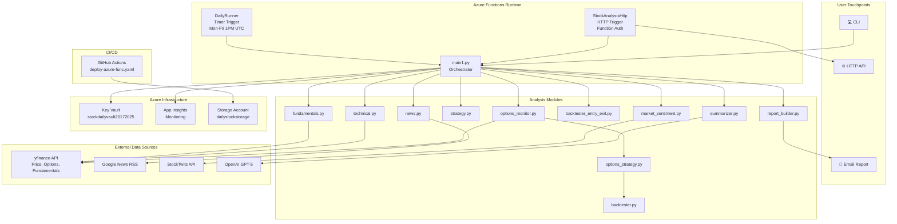
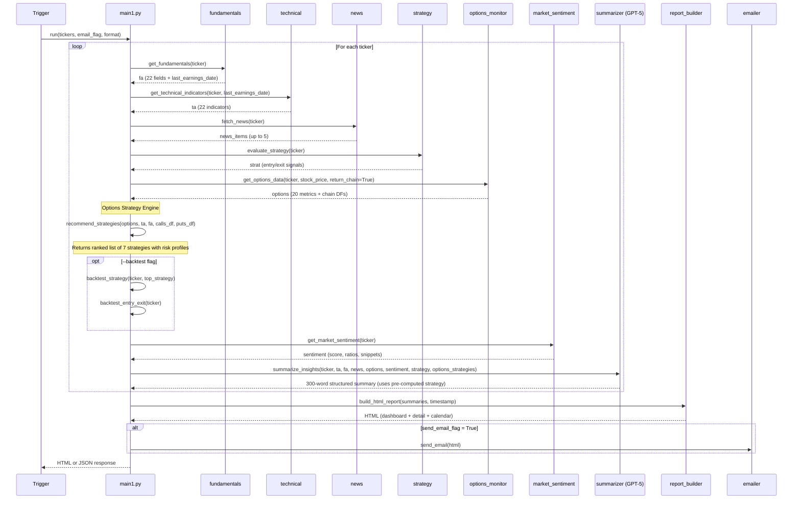
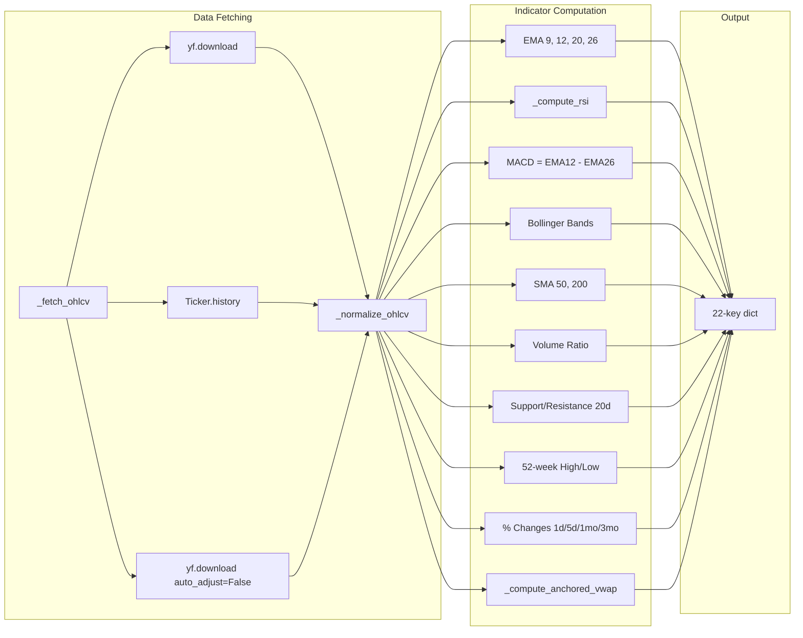
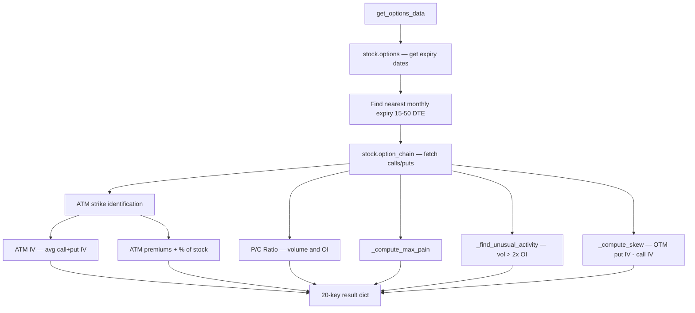
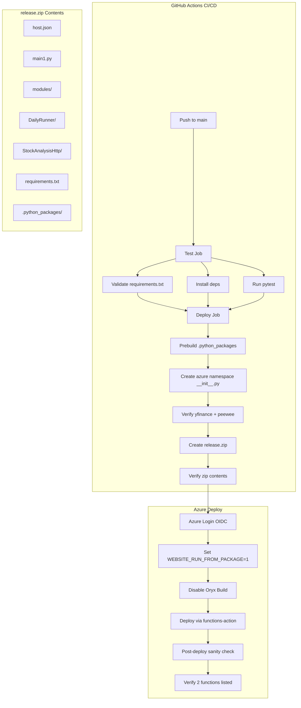
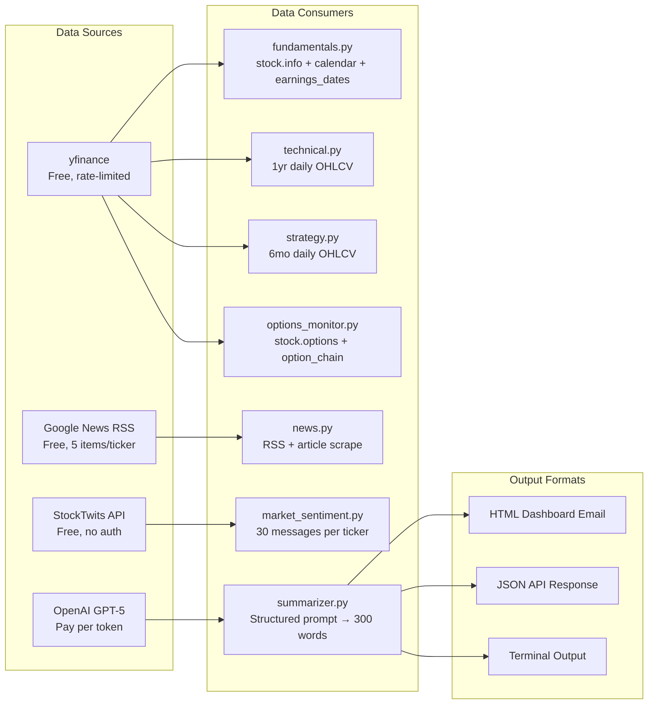
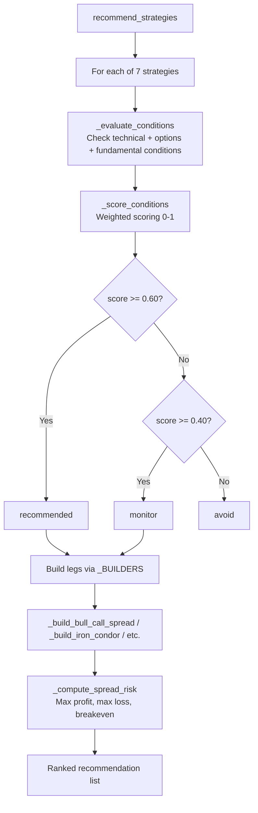
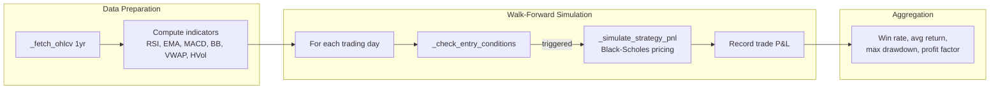

# Daily Stock Analysis — System Architecture

## System-Level View



### ASCII Fallback — System Level

```
┌─────────────────────────────────────────────────────────────────────┐
│                        USER TOUCHPOINTS                             │
│   📧 Email (Timer)    🌐 HTTP API (Ad-hoc)    💻 CLI (Local)       │
└──────────┬──────────────────┬─────────────────────┬─────────────────┘
           │                  │                     │
           ▼                  ▼                     ▼
┌──────────────────────────────────────────────────────────────────────┐
│                    AZURE FUNCTIONS RUNTIME                            │
│                                                                      │
│  ┌──────────────┐  ┌──────────────────┐  ┌────────────────────────┐  │
│  │ DailyRunner  │  │ StockAnalysisHttp│  │ main1.py               │  │
│  │ Timer Trigger│──│ HTTP Trigger     │──│ Orchestrator           │  │
│  │ M-F 1PM UTC  │  │ Function Auth    │  │ run(tickers, email,fmt)│  │
│  └──────────────┘  └──────────────────┘  └──────────┬─────────────┘  │
└─────────────────────────────────────────────────────┼────────────────┘
                                                      │
                    ┌─────────────────────────────────┼──────────────┐
                    │         ANALYSIS PIPELINE        │              │
                    │                                  ▼              │
                    │  1. fundamentals.py ──── yfinance .info         │
                    │  2. technical.py ─────── yfinance OHLCV (1yr)   │
                    │  3. news.py ──────────── Google News RSS        │
                    │  4. strategy.py ──────── yfinance OHLCV (6mo)   │
                    │  5. options_monitor.py ── yfinance .option_chain │
                    │  5b.options_strategy.py ─ 7-strategy engine     │
                    │  5c.backtester.py ─────── BS backtest (opt.)    │
                    │     backtester_entry_exit  signal backtest       │
                    │  6. market_sentiment.py ─ StockTwits API        │
                    │  7. summarizer.py ─────── OpenAI GPT-5          │
                    │  8. report_builder.py ── HTML generation        │
                    └─────────────────────────────────────────────────┘
                                                      │
           ┌──────────────────────────────────────────┼──────────────┐
           │              AZURE INFRASTRUCTURE         │              │
           │  ┌────────────┐ ┌─────────────┐ ┌───────┴──────────┐   │
           │  │ Key Vault  │ │ App Insights│ │ Storage Account  │   │
           │  │ Tickers    │ │ Logs/Errors │ │ ZIP Deploy Pkgs  │   │
           │  └────────────┘ └─────────────┘ └──────────────────┘   │
           └────────────────────────────────────────────────────────┘
```

---

## Pipeline-Level View



---

## Module-Level View

### technical.py — Internal Structure



### options_monitor.py — Internal Structure



---

## Deployment View



### ASCII Fallback — Deployment

```
GitHub Push to main
        │
        ▼
┌──────────────────────────────┐
│       TEST JOB               │
│  1. Validate requirements.txt│
│  2. Install deps             │
│  3. Run pytest               │
└──────────────┬───────────────┘
               │ (pass)
               ▼
┌──────────────────────────────┐
│       DEPLOY JOB             │
│  1. Prebuild .python_packages│
│  2. Create azure __init__.py │
│  3. Verify packages          │
│  4. Create release.zip       │
│     ├── host.json            │
│     ├── main1.py             │
│     ├── modules/             │
│     ├── DailyRunner/         │
│     ├── StockAnalysisHttp/   │
│     ├── requirements.txt     │
│     └── .python_packages/    │
│  5. Verify zip contents      │
│  6. Azure login (OIDC)       │
│  7. Set run-from-package     │
│  8. Disable Oryx             │
│  9. Deploy                   │
│ 10. Sanity check (2 funcs)   │
└──────────────────────────────┘
```

---

## Data Flow View



### ASCII Fallback — Data Flow

```
DATA SOURCES                  MODULES                      OUTPUTS
────────────                  ───────                      ───────

yfinance ─────┬── fundamentals.py (stock.info)
              ├── technical.py (1yr OHLCV)         ┌── 📧 HTML Email
              ├── strategy.py (6mo OHLCV)    ──────┤── 🌐 JSON API
              └── options_monitor.py (chains)       └── 💻 Terminal
                                               ▲
Google News ──── news.py (RSS + scrape)        │
                                               │
StockTwits ───── market_sentiment.py ──────────┤
                                               │
OpenAI GPT-5 ── summarizer.py ────────────────┘
```

---

## Technical Indicators Computed

| Module | Indicator | Method |
|--------|-----------|--------|
| technical.py | EMA 9, EMA 20 | Exponential moving average |
| technical.py | RSI (14) | Wilder RSI via rolling gain/loss |
| technical.py | MACD line | EMA(12) - EMA(26) |
| technical.py | MACD signal | EMA(9) of MACD line |
| technical.py | MACD histogram | MACD line - signal |
| technical.py | Bollinger upper | SMA(20) + 2*StdDev(20) |
| technical.py | Bollinger lower | SMA(20) - 2*StdDev(20) |
| technical.py | BB width | (upper - lower) / SMA(20) |
| technical.py | SMA 50, SMA 200 | Simple moving average |
| technical.py | Anchored VWAP | From last earnings or 20-day rolling |
| technical.py | Volume ratio | Today vol / 20-day avg vol |
| technical.py | Support (20d) | 20-day rolling low |
| technical.py | Resistance (20d) | 20-day rolling high |
| technical.py | 52-week high/low | Max/min over 1 year |
| technical.py | % changes | 1d, 5d, 1mo, 3mo |
| strategy.py | ATR (14) | Average true range |
| options_monitor.py | ATM IV | Avg of ATM call + put IV |
| options_monitor.py | Max pain | Strike minimizing total ITM value |
| options_monitor.py | IV skew | OTM put IV - OTM call IV (5% OTM) |
| options_monitor.py | P/C ratio | Volume and open interest ratios |

---

## Options Strategy Engine

### options_strategy.py — Internal Structure



### backtester.py — Internal Structure


